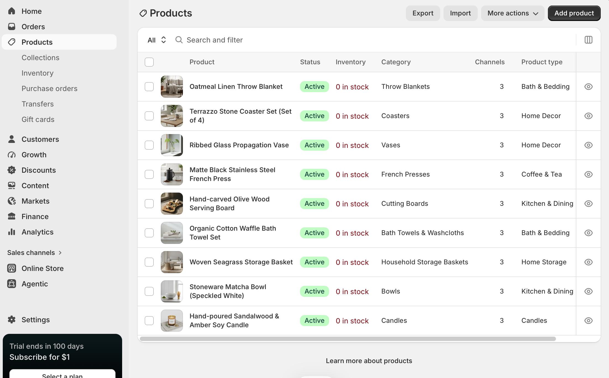

# 1. Product List

Welcome to **Atelier North**, a curated home goods store focused on minimalist design, intentional living, and high-quality natural materials. Below are the 10 products currently added to the Shopify store:

1.  Hand-poured Sandalwood & Amber Soy Candle
2.  Stoneware Matcha Bowl (Speckled White)
3.  Woven Seagrass Storage Basket
4.  Organic Cotton Waffle Bath Towel Set
5.  Hand-carved Olive Wood Serving Board
6.  Matte Black Stainless Steel French Press
7.  Ribbed Glass Propagation Vase
8.  Terrazzo Stone Coaster Set (Set of 4)
9.  Oatmeal Linen Throw Blanket

# 2. Product Information Evidence & Descriptions

### Product 1: Hand-poured Sandalwood & Amber Soy Candle

**Price:** \$28.00 \| **Inventory:** 25 in stock \| **Type:** Home Fragrance \| **Vendor:** Atelier North **Description:** Transform your living space into a calm sanctuary with our Sandalwood & Amber Soy Candle. Hand-poured in small batches using 100% natural soy wax and lead-free cotton wicks, this candle offers a clean, 45-hour burn. The warm, earthy notes of sandalwood perfectly balance with the subtle sweetness of amber, making it the perfect companion for cozy evenings or focused morning routines.

### Product 2: Stoneware Matcha Bowl (Speckled White)

**Price:** \$34.00 \| **Inventory:** 15 in stock \| **Type:** Drinkware \| **Vendor:** Atelier North **Description:** Elevate your daily tea ritual with this handcrafted Stoneware Matcha Bowl. Designed with a wide base to allow for the perfect whisking motion, its beautiful speckled white glaze ensures that no two bowls are exactly alike. Durable enough for everyday use yet elegant enough to display on open shelving, it’s a must-have for any matcha enthusiast.

### Product 3: Woven Seagrass Storage Basket

**Price:** \$42.00 \| **Inventory:** 12 in stock \| **Type:** Storage \| **Vendor:** Atelier North **Description:** Keep your space tidy without sacrificing style. Woven by hand from sustainable seagrass, this sturdy storage basket features reinforced handles and a natural, textured finish that brings warmth to any room. It’s perfectly sized for storing extra throw blankets, organizing magazines, or housing your favorite medium-sized indoor plant.

### Product 4: Organic Cotton Waffle Bath Towel Set

**Price:** \$65.00 \| **Inventory:** 20 in stock \| **Type:** Bath \| **Vendor:** Atelier North **Description:** Experience spa-level luxury at home. Woven from 100% organic cotton, these waffle-knit bath towels are highly absorbent, lightweight, and incredibly quick-drying. The honeycomb texture gently exfoliates the skin while remaining ultra-soft. Designed to naturally resist odors and mildew, they are the perfect upgrade for a modern, minimalist bathroom.

### Product 5: Hand-carved Olive Wood Serving Board

**Price:** \$55.00 \| **Inventory:** 10 in stock \| **Type:** Kitchenware \| **Vendor:** Atelier North **Description:** Serve your charcuterie with a touch of rustic elegance. Carved from a single piece of sustainably sourced Mediterranean olive wood, this serving board highlights stunning natural wood grains and live edges. Because of the dense nature of olive wood, it resists odors and stains, making it as functional for slicing artisan bread as it is beautiful for entertaining guests.

### Product 6: Matte Black Stainless Steel French Press

**Price:** \$48.00 \| **Inventory:** 18 in stock \| **Type:** Drinkware \| **Vendor:** Atelier North **Description:** Start your morning right with a bold, full-bodied brew. This sleek, matte black French Press features double-walled stainless steel construction to keep your coffee piping hot for hours, while the exterior remains cool to the touch. The fine-mesh dual-filter system ensures a smooth, grit-free cup every time, completely eliminating the need for paper filters.

### Product 7: Ribbed Glass Propagation Vase

**Price:** \$22.00 \| **Inventory:** 30 in stock \| **Type:** Decor \| **Vendor:** Atelier North **Description:** Bring life to your windowsill or desk with our Ribbed Glass Propagation Vase. The vintage-inspired ribbed detailing catches the sunlight beautifully, while the narrow neck provides the perfect support for propagating plant cuttings, displaying a single stem, or rooting avocado seeds. It is a simple, elegant way to bring a touch of the outdoors inside.

### Product 8: Terrazzo Stone Coaster Set (Set of 4)

**Price:** \$26.00 \| **Inventory:** 22 in stock \| **Type:** Decor \| **Vendor:** Atelier North **Description:** Protect your surfaces with a pop of subtle color and modern texture. These terrazzo coasters are cast by hand, featuring unique flecks of recycled glass and marble. Each coaster is finished with a soft cork backing to prevent scratching on wooden tables and countertops. They are the perfect functional accent piece for your coffee table.

### Product 9: Oatmeal Linen Throw Blanket

**Price:** \$85.00 \| **Inventory:** 8 in stock \| **Type:** Textiles \| **Vendor:** Atelier North **Description:** Drape your sofa or bed in effortless comfort. Made from 100% European flax linen, this oatmeal-toned throw blanket is stone-washed for supreme softness from day one. Linen is naturally highly breathable and temperature-regulating, meaning this throw will keep you cozy during winter evenings and cool during summer afternoon naps.

------------------------------------------------------------------------

# 3. Assortment Strategy Reflection

The product assortment at **Atelier North** was strategically designed around the concept of "slow living" and intentional home curation. Rather than offering a chaotic mix of random household items, these ten products are unified by a distinct aesthetic—neutral color palettes, organic textures, and natural materials like stoneware, linen, seagrass, and olive wood. They belong together because they collectively serve a specific target customer: young professionals or design-conscious individuals who view their home as a calming sanctuary and are willing to pay a premium for high-quality, sustainable, and aesthetically pleasing everyday goods. Every item balances practical utility with visual appeal, ensuring that even functional tools (like a watering can or a French press) double as beautiful decor, directly supporting the store’s minimalist, curated concept.

------------------------------------------------------------------------

# 4. Cal Poly Pomona Farm Store Application Reflection

When presenting products online, the **Cal Poly Pomona (CPP) Farm Store** should focus heavily on storytelling and provenance to differentiate itself from standard grocery e-commerce. Because the store features student-grown produce, local goods, and university-made products (like their famous nursery plants or fresh juices), the online product pages must highlight this unique origin. They should consider implementing badges or specific tags (e.g., "Student-Grown," "Local," "Seasonal") directly on product images. Furthermore, because agricultural products are highly seasonal and perishable, their Shopify setup must prioritize clear, real-time inventory tracking and distinct communication regarding fulfillment (e.g., specifying if items are for local pickup only vs. available for shipping). High-quality, bright imagery that conveys freshness will be essential in translating the vibrant, hands-on experience of the physical Farm Store to a digital platform.