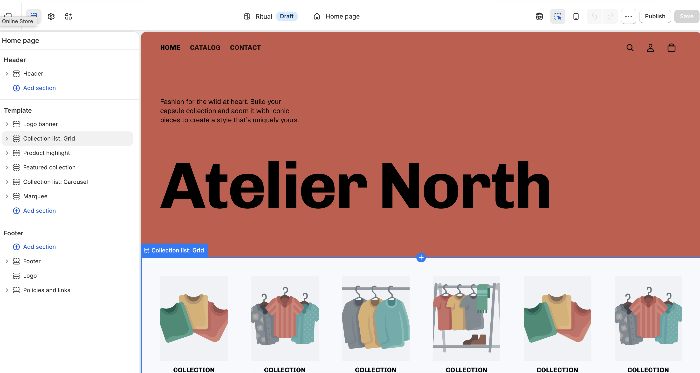

## Store Name and Concept

**Store Name:** Atelier North\
**Concept:** Atelier North is a modern lifestyle store specializing in minimalist home goods, design-forward accessories, and curated everyday essentials. The store focuses on clean aesthetics, functional design, and high-quality materials inspired by Scandinavian and Japanese design principles.

------------------------------------------------------------------------

## Target Customer

The target customer is design-conscious and values simplicity, quality, and aesthetics in everyday life.

- **Age range:** 25–45\
- **Income level:** Middle to upper-middle income\
- **Lifestyle:** Urban professionals, creatives, and remote workers who prioritize well-designed living spaces\
- **Shopping behavior:** Prefers curated collections over large catalogs, willing to pay more for durable and thoughtfully designed products, often shops online for convenience and inspiration-driven purchases (e.g., Instagram, Pinterest, design blogs)

------------------------------------------------------------------------

## Product Category Plan

Atelier North will include the following product categories:

1.  **Home Décor** – minimalist décor pieces, vases, wall art, lighting\
2.  **Kitchen & Dining** – ceramic dishware, glassware, utensils, and serving essentials\
3.  **Lifestyle Accessories** – candles, stationery, organizers, and personal items\
4.  **Furniture Accents** – small-scale furniture such as stools, side tables, and shelves\
5.  **Wellness & Self-Care** – bath products, aromatherapy items, and relaxation tools

## Connection to Cal Poly Pomona Farm Store

Developing Atelier North helped me think more critically about how product curation, branding, and customer targeting influence the overall shopping experience, which directly connects to the Cal Poly Pomona Farm Store consulting project. In particular, focusing on a clearly defined target customer and curated product categories highlighted the importance of aligning inventory and merchandising with specific customer needs and expectations. For the CPP Farm Store, this approach could translate into better organization of local products, clearer branding around sustainability and campus agriculture, and more intentional product placement to improve the customer journey. It also reinforced how store layout, storytelling, and product selection can shape perception and increase engagement, even for a smaller or campus-based retail environment.

# Store Setup Page

{width=70%}

